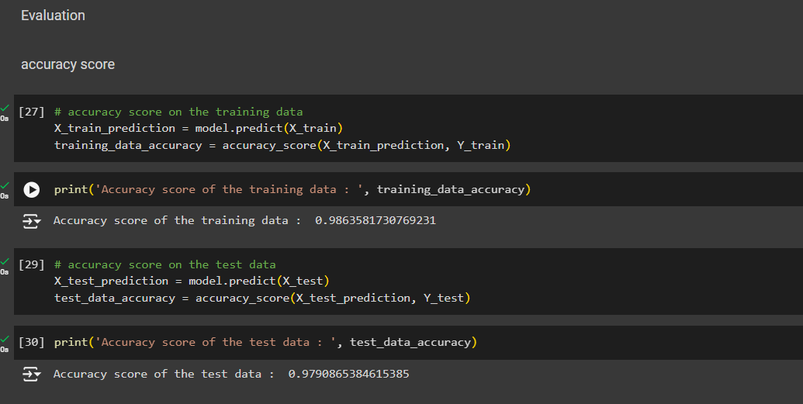
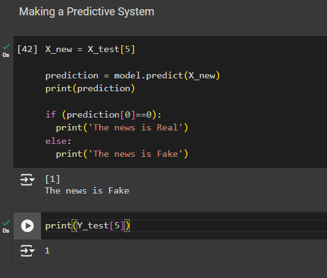
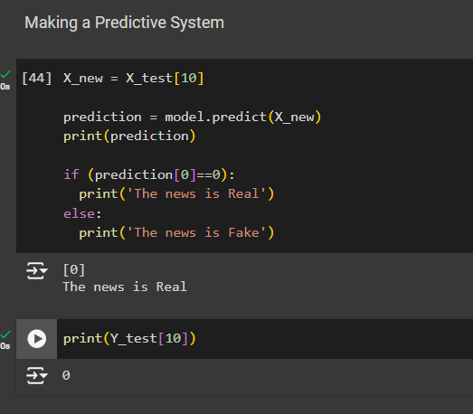
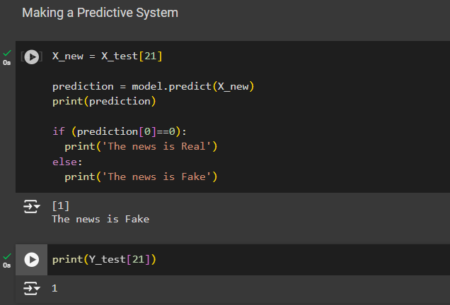

# Fake News Prediction

## Description
This project focuses on building a machine learning model to predict whether a news article is fake or real. Using a dataset of news articles, the model processes the text to classify it into genuine or fake categories. The project leverages natural language processing techniques and machine learning algorithms for accurate predictions.

## Features
- Preprocessing of text data including tokenization and vectorization.
- Implementation of machine learning models like Logistic Regression and Support Vector Machines.
- Evaluation metrics such as accuracy, precision, and recall.
- Real-time prediction functionality using pre-trained models.

  ## Results
  <table>
    <tr>
        <td></td>
        <td></td>
    </tr>
    <tr>
        <td></td>
        <td></td>
    </tr>
</table>

## Requirements
- Python 3.x
- Jupyter Notebook
- Libraries: NumPy, Pandas, Scikit-learn, NLTK, Matplotlib, Seaborn

# How to Run the Fake News Prediction Project

### Step 1: Clone the Repository
Start by cloning the project repository to your local machine.

```bash
git clone https://github.com/Arshad-khan05/Fake-News-Prediction.git
```

### Step 2: Navigate to the Project Directory
Move into the project directory where the notebook and requirements files are stored.

```bash
cd <project_directory>
```

### Step 3: Set Up a Virtual Environment (Optional)
Create and activate a virtual environment to isolate project dependencies.

```bash
python -m venv venv
source venv/bin/activate   # On Windows, use: venv\Scripts\activate
```

### Step 4: Install Dependencies
Use the requirements.txt file to install all necessary libraries.

```bash
pip install -r requirements.txt
```

### Step 5: Run the Jupyter Notebook
Launch Jupyter Notebook to work with the Fake News Prediction.ipynb file.

```bash
jupyter notebook
```

### Step 6: Execute the Project
- Open the Fake News Prediction.ipynb file in Jupyter Notebook.
- Follow the notebook instructions to load the dataset, preprocess the data, and train the models.
- Run the necessary cells to make predictions and evaluate model performance.
